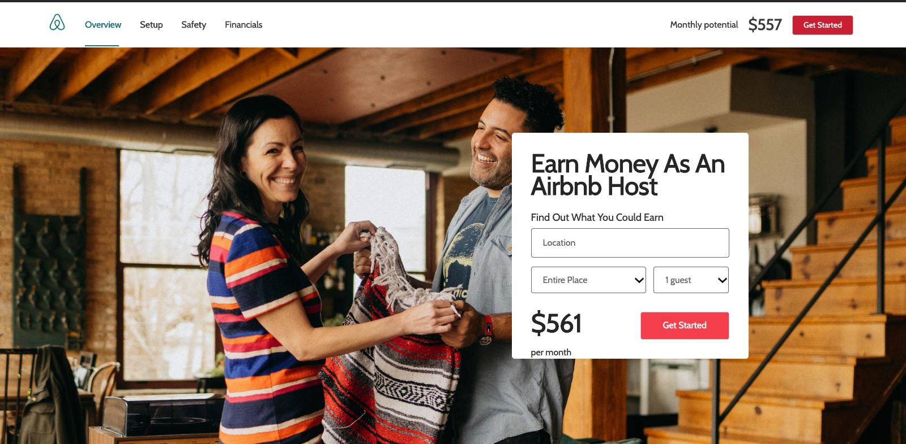

# airbnb-clone
Airbnb clone is a onepage html and css project replicating a page on the official **Airbnb** website
> https://www.airbnb.com/host/homes

The project is the exact replica of the contents on the page link above as at 25 - 01 - 2019.

## Technologies
HTML 5

CSS 3

## Framework
CSS Reset

## Setup
> Open your git bash and **cd** to the location you'd like to put your files the run the command below.

`git clone https://github.com/AdnanAfsari/airbnb-clone.git`

Here is a link to the live preview [preview](https://raw.githack.com/AdnanAfsari/airbnb-clone/development/index.html)

## Author
[James Okunlade](https://github.com/JamesOkunlade)

[Adnan Afsari](https://github.com/AdnanAfsari)
